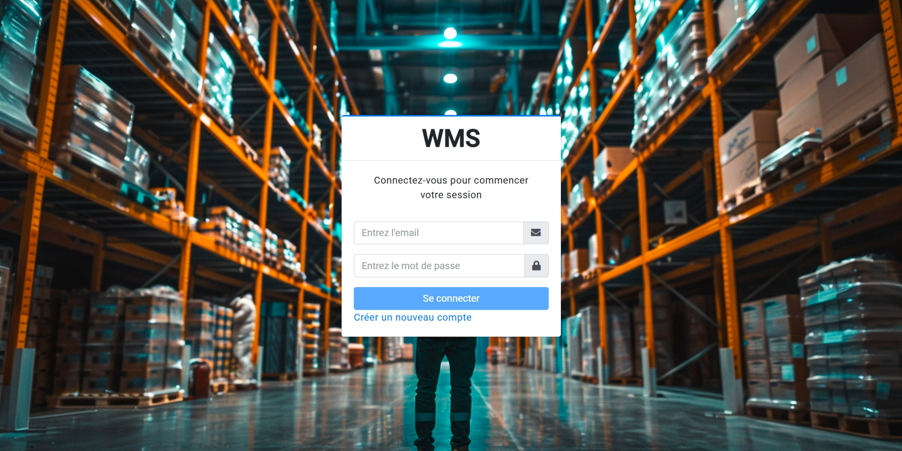
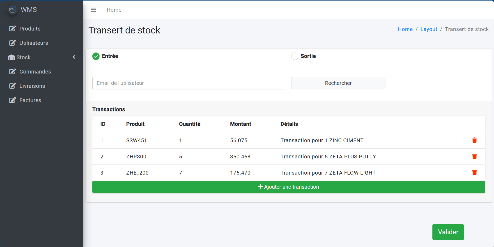
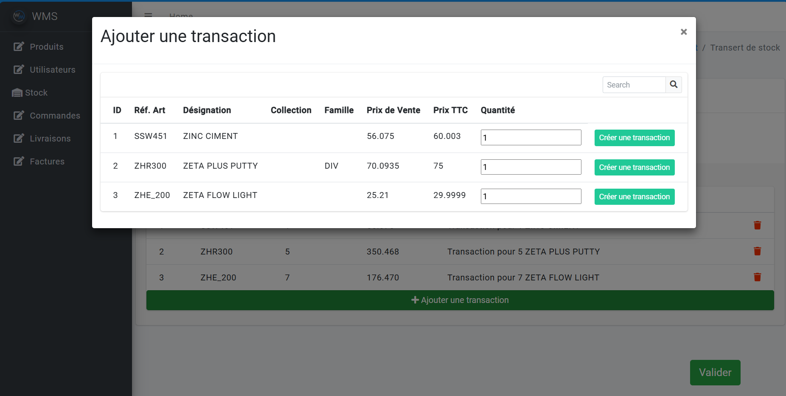
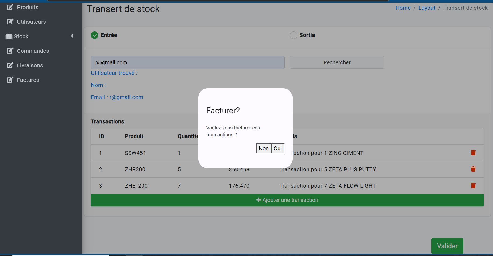
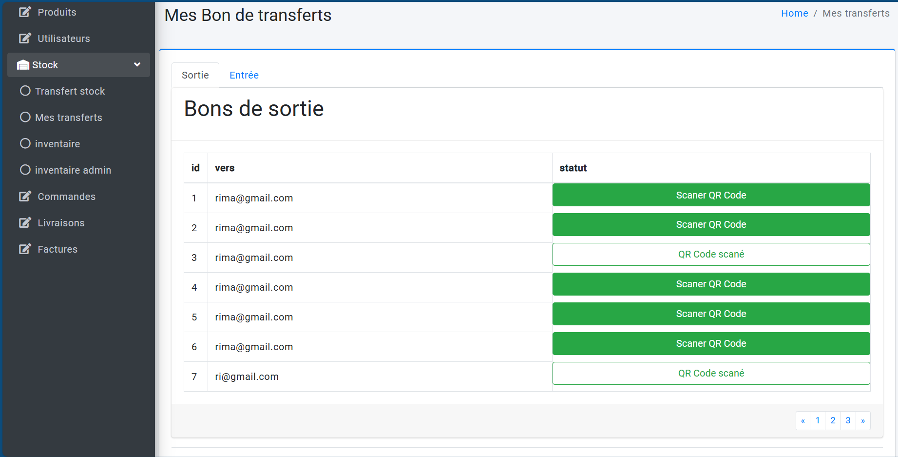
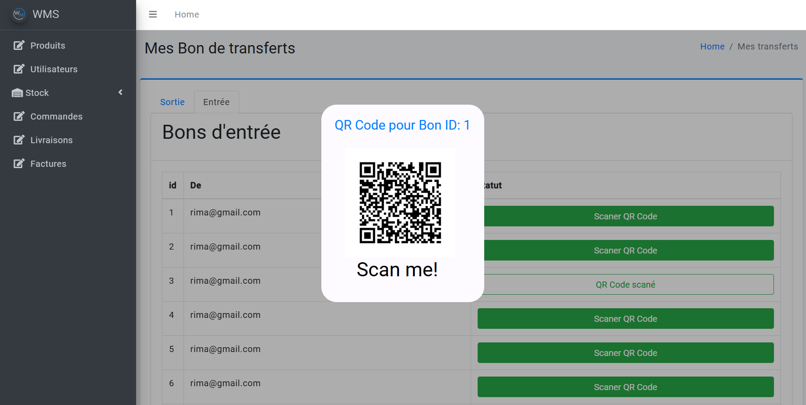
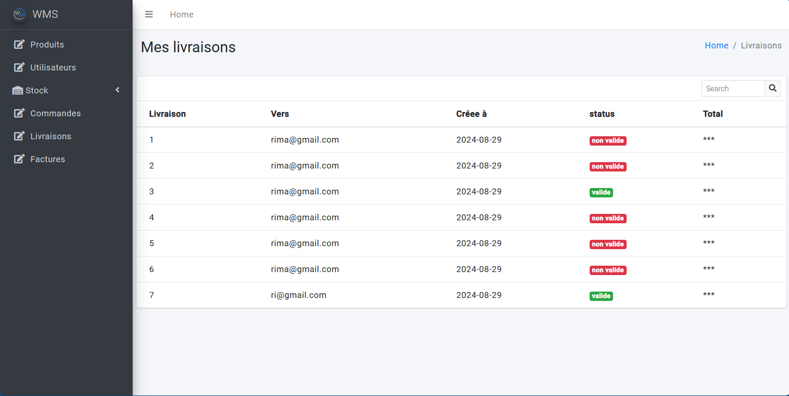
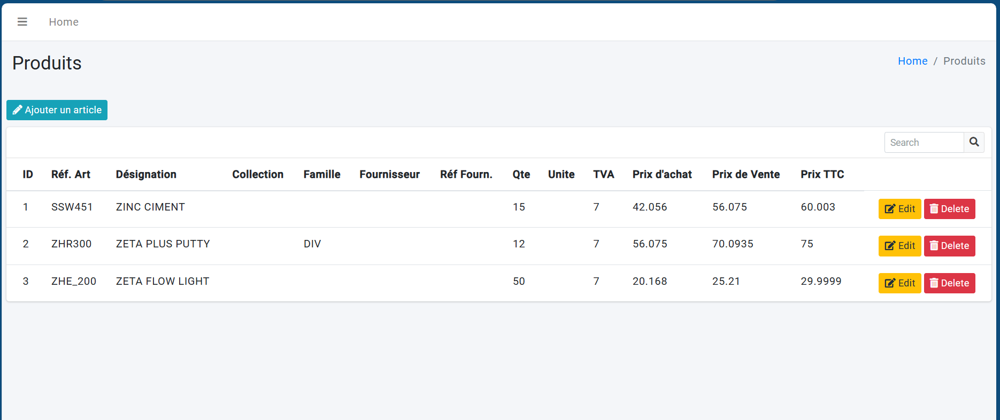
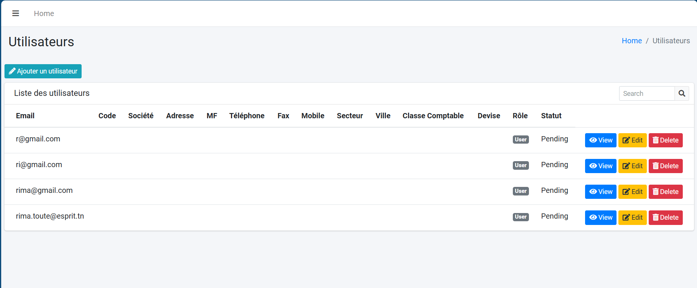
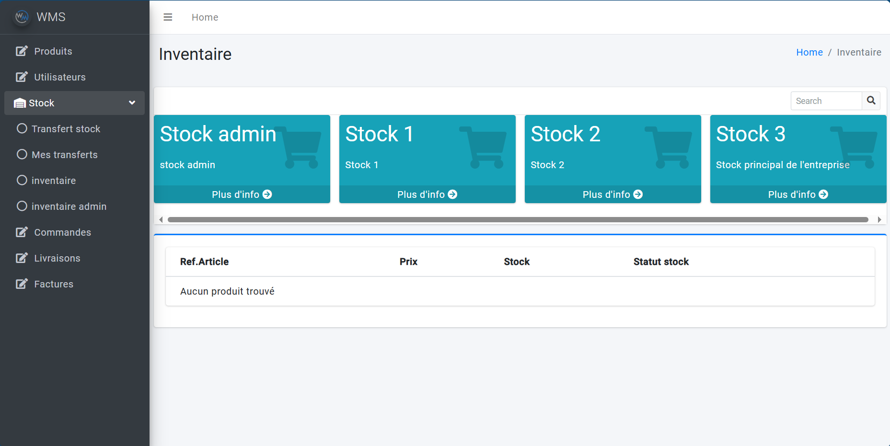

# WMSFront

This project was generated with [Angular CLI](https://github.com/angular/angular-cli) version 18.0.1.


# WMS - Warehouse Management System

This WMS (Warehouse Management System) is a web-based platform designed to streamline warehouse operations by managing transactions, stock movements, invoices, and products.

## Features

- **User Accounts**: Create an account, log in, and manage your profile.
- **Transaction Management**: Handles all voucher types (types de Bon) including entries, exits, deliveries, and transfers..
- **Real-Time Stock Management**: Updates and monitors stock movements per user and warehouse instantly.
- **Billing & Invoicing**: Generates consolidated invoices.
- **products management**: Enables admins to manage all products.

## Technologies Used

- **Frontend**: Angular 18, CSS
- **Backend**: Spring Boot
- **Database**: MySQL
- **Additional Libraries**: angular material, chart.js,JWT Authentication 

## Installation

1. Clone the repository:
   ```bash
   git clone https://github.com/Touterima/WMS__Front.git
   cd WMSFront
   ```

2. Install dependencies for both the client and server:
   ```bash
   npm install
   ```
   
3. Run the development server:
   
   ```bash
   ng serve
   ```
   Then navigate to:

   ```bash
   http://localhost:4200/
   ```
   


## Screenshots:

   -  **Log In Page** :
   

   -  **Sign Up Page** :
   
   
   -  **Create transaction** :
   

   

   

   -  **Scan the Purchase voucher to accept the transaction** :
   

    

   -  **user's transactions management** :
   

   -  **Admin Products management** :
   

   -  **Admin users management** :
   

   -  **Admin Warehouses inventory management** :
   

## Licence

This project is licensed under the MIT License.
